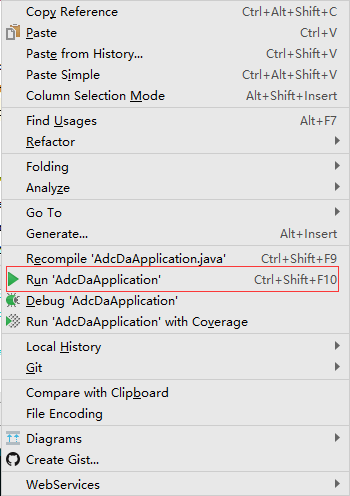
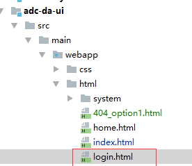
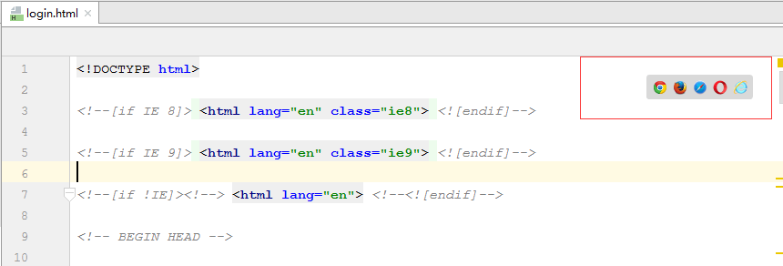
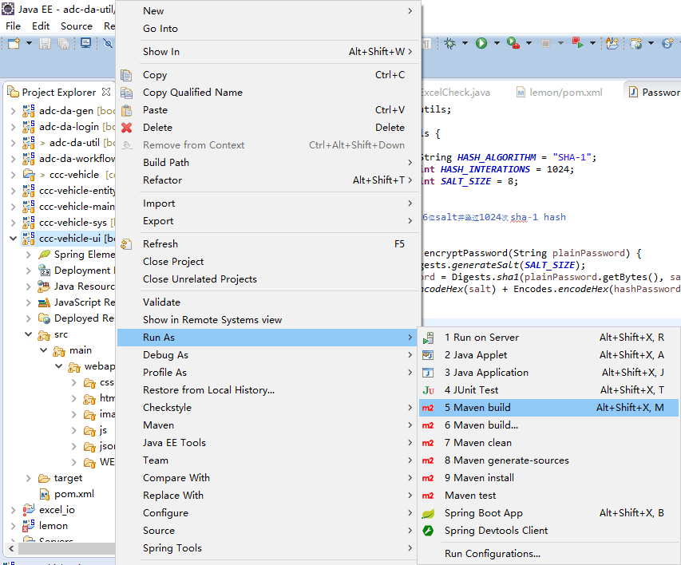
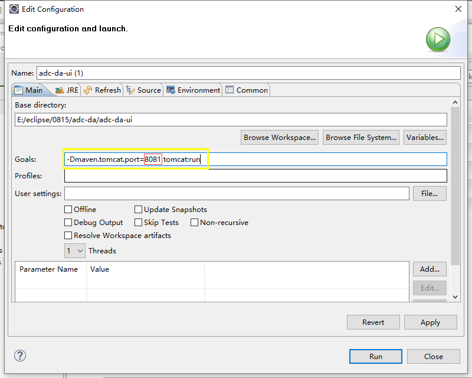
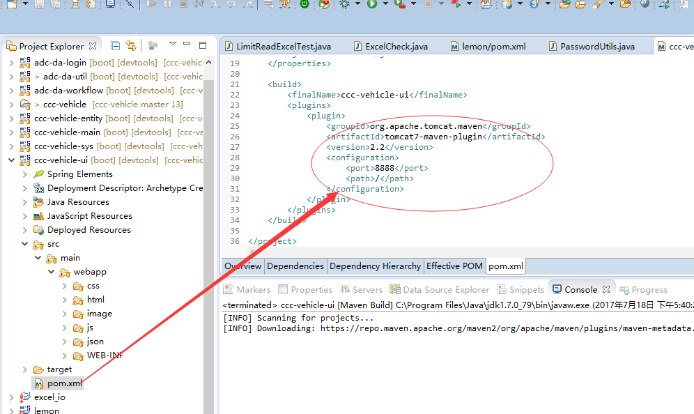
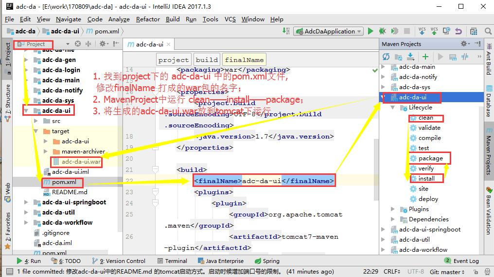
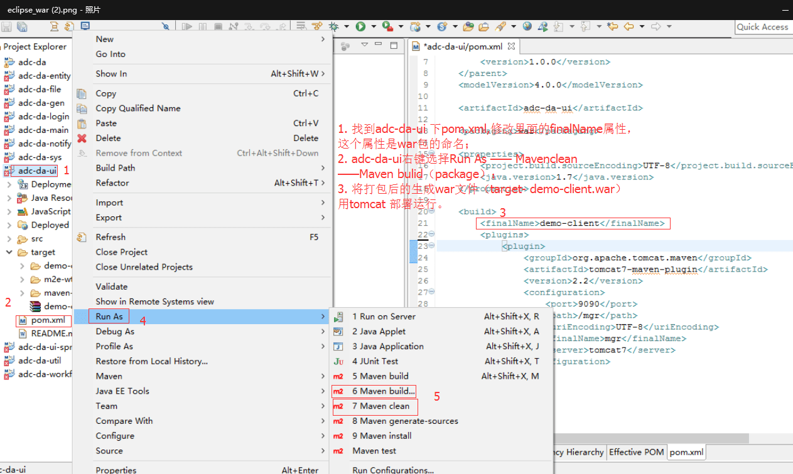

## 数据资源中心高效研发框架 **ADC-DA** 
##前端 启动方式
>1. 使用idea 
>>1.1首先启动后台 main 文件下的AdcDaApplication
 
>>1.2. 找到要加载的页面 
 
>>1.3. 通过页面上idea 自带的服务器启动html页面
 
>2.使用eclipse 通过maven插件启动
 >>
 >>
 >>如何配置端口号
 >> -Dmaven.tomcat.port=8081 tomcat:run
## 

>3.页面中仿照一般的html页面编写调用，数据通过json格式传输。
>4.超过20行的js和5行的css则分开写到js或css文件中。

>5.前端idea如何打war包
>>1. 找到project下的 adc-da-ui 中的pom.xml文件,
 修改finalName， 这是生成的war包的名字；
>>2. MavenProject中运行 clean——install——package；
>>3. 将生成的adc-da-ui.war放到tomcat下运行

>6.前端eclipse如何打war包
>>1. 找到adc-da-ui目录中的pom.xml文件,
 修改finalName， 这是生成的war包的名字；
>>2. 右键adc-da-ui选择Run As 选择 Maven clean 在选择Maven build 在Goals下填写package 点击Run；
>>3. 将在target目录下生成的adc-da-ui.war放到tomcat下部署运行。
